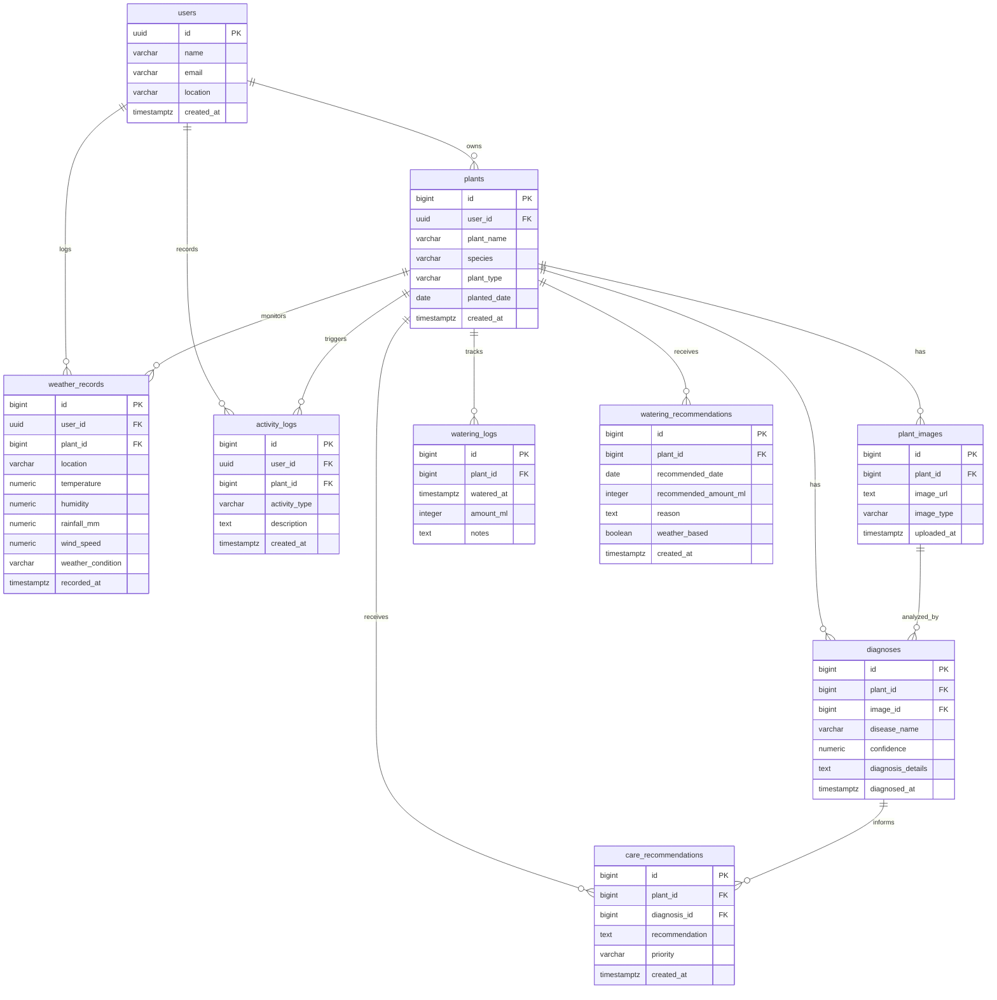

# Supabase Database Schema Specification

**Project:** AI Urban Farming Assistant  
**Database Platform:** Supabase PostgreSQL  
**Audit Source:** Supabase PostgREST Metadata & Live Database Inspection  
**Status:** Verified & Stable  

---

## 1. Overview

The AI Urban Farming Assistant database resides on a managed Supabase PostgreSQL instance. It contains 9 application tables supporting user profiles, plant catalogs, leaf image metadata, disease diagnosis history, care instructions, watering telemetry, weather observations, and audit activities.

---

## 2. Entity Relationship Diagram

---

## 3. Table Definitions & Column Specifications

### 3.1 `users`
Stores user profile information.
- **`id`** (`uuid`, Primary Key, Required): User unique identifier (matches Supabase Auth user UUID).
- **`name`** (`character varying(100)`): Display name of the user.
- **`email`** (`character varying(255)`): Email address.
- **`location`** (`character varying(255)`): User geographic location / city for weather observations.
- **`created_at`** (`timestamp with time zone`, Default: `now()`): Record creation timestamp.

---

### 3.2 `plants`
Core registry of individual plants maintained by urban gardeners.
- **`id`** (`bigint` / `int64`, Primary Key, Required): Unique plant identifier.
- **`user_id`** (`uuid`, Foreign Key -> `users.id`, Required): Owner reference.
- **`plant_name`** (`character varying(100)`, Required): User-assigned plant name (e.g., "Balcony Tomato").
- **`species`** (`character varying(150)`): Scientific or colloquial species (e.g., "Solanum lycopersicum").
- **`plant_type`** (`character varying(100)`): Category (e.g., "Vegetable", "Herb", "Fruit", "Indoor").
- **`planted_date`** (`date`): Date planted or acquired.
- **`created_at`** (`timestamp with time zone`, Default: `now()`): Record creation timestamp.

---

### 3.3 `plant_images`
Metadata tracking uploaded plant photographs stored in the Supabase Storage bucket (`plant-images`).
- **`id`** (`bigint` / `int64`, Primary Key, Required): Unique image record identifier.
- **`plant_id`** (`bigint` / `int64`, Foreign Key -> `plants.id`, Required): Associated plant.
- **`image_url`** (`text`, Required): Relative Supabase Storage path (e.g., `plants/{plant_id}/{uuid}.jpg`).
- **`image_type`** (`character varying(50)`): MIME type (e.g., `image/jpeg`, `image/png`, `image/webp`).
- **`uploaded_at`** (`timestamp with time zone`, Default: `now()`): Upload timestamp.

---

### 3.4 `diagnoses`
Results of AI plant disease analyses conducted on uploaded leaf images.
- **`id`** (`bigint` / `int64`, Primary Key, Required): Unique diagnosis record identifier.
- **`plant_id`** (`bigint` / `int64`, Foreign Key -> `plants.id`, Required): Associated plant.
- **`image_id`** (`bigint` / `int64`, Foreign Key -> `plant_images.id`): Leaf photograph analyzed.
- **`disease_name`** (`character varying(200)`, Required): Identified disease or "Healthy Leaf".
- **`confidence`** (`numeric`): Confidence score from 0.0 to 1.0 (or percentage).
- **`diagnosis_details`** (`text`): Detailed description of symptoms and analysis observations.
- **`diagnosed_at`** (`timestamp with time zone`, Default: `now()`): Timestamp when diagnosis ran.

---

### 3.5 `care_recommendations`
Specific care suggestions linked to plants and diagnoses.
- **`id`** (`bigint` / `int64`, Primary Key, Required): Unique care recommendation identifier.
- **`plant_id`** (`bigint` / `int64`, Foreign Key -> `plants.id`, Required): Target plant.
- **`diagnosis_id`** (`bigint` / `int64`, Foreign Key -> `diagnoses.id`): Associated diagnosis (nullable for general care).
- **`recommendation`** (`text`, Required): Prescribed treatment or care action.
- **`priority`** (`character varying(50)`): Urgency level (`low`, `medium`, `high`, `urgent`).
- **`created_at`** (`timestamp with time zone`, Default: `now()`): Creation timestamp.

---

### 3.6 `watering_logs`
Historical audit logs of actual watering events executed by the user.
- **`id`** (`bigint` / `int64`, Primary Key, Required): Unique log identifier.
- **`plant_id`** (`bigint` / `int64`, Foreign Key -> `plants.id`, Required): Target plant.
- **`watered_at`** (`timestamp with time zone`, Default: `now()`): Time the plant was watered.
- **`amount_ml`** (`integer` / `int32`): Water volume administered in milliliters.
- **`notes`** (`text`): Optional notes (e.g., "Added liquid seaweed fertilizer").

---

### 3.7 `watering_recommendations`
Algorithmic or schedule-based watering advice generated for plants.
- **`id`** (`bigint` / `int64`, Primary Key, Required): Unique recommendation identifier.
- **`plant_id`** (`bigint` / `int64`, Foreign Key -> `plants.id`, Required): Target plant.
- **`recommended_date`** (`date`): Date for proposed watering.
- **`recommended_amount_ml`** (`integer` / `int32`): Suggested water amount in milliliters.
- **`reason`** (`text`): Rationale (e.g., "Soil dry, high temperature expected").
- **`weather_based`** (`boolean`, Default: `false`): Flag indicating if weather telemetry adjusted this suggestion.
- **`created_at`** (`timestamp with time zone`, Default: `now()`): Creation timestamp.

---

### 3.8 `weather_records`
Telemetry observations of local ambient and environmental conditions.
- **`id`** (`bigint` / `int64`, Primary Key, Required): Unique weather record identifier.
- **`user_id`** (`uuid`, Foreign Key -> `users.id`): User reference.
- **`plant_id`** (`bigint` / `int64`, Foreign Key -> `plants.id`): Associated plant.
- **`location`** (`character varying(255)`): Geographic station or location string.
- **`temperature`** (`numeric`): Temperature in °C.
- **`humidity`** (`numeric`): Relative humidity percentage (0-100%).
- **`rainfall_mm`** (`numeric`): Precipitation volume in mm.
- **`wind_speed`** (`numeric`): Wind speed in km/h.
- **`weather_condition`** (`character varying(100)`): Condition description (e.g., "Sunny", "Rainy", "Overcast").
- **`recorded_at`** (`timestamp with time zone`, Default: `now()`): Observation timestamp.

---

### 3.9 `activity_logs`
Comprehensive user audit trail capturing interactions and milestones.
- **`id`** (`bigint` / `int64`, Primary Key, Required): Unique activity identifier.
- **`user_id`** (`uuid`, Foreign Key -> `users.id`): Acting user.
- **`plant_id`** (`bigint` / `int64`, Foreign Key -> `plants.id`): Affected plant.
- **`activity_type`** (`character varying(100)`, Required): Event classification:
  - `plant_created`
  - `image_uploaded`
  - `diagnosis_created`
  - `plant_watered`
  - `care_viewed`
- **`description`** (`text`): Human-readable event description.
- **`created_at`** (`timestamp with time zone`, Default: `now()`): Event timestamp.

---

## 4. Key Findings & Discrepancies Resolved During Audit

1. **Table Naming:**
   - Database table is `weather_records` (previously referenced in some notes as `weather_observations`). The backend correctly queries `weather_records`.
   - Recommendations table is `watering_recommendations` (not `watering_schedules`).
2. **Key Constraints:**
   - Primary keys on all entity tables (`plants`, `plant_images`, `diagnoses`, etc.) are 64-bit integers (`bigint`), except `users` which uses `uuid`.
   - Foreign keys enforce referential integrity across the hierarchy.
3. **No Migration Needed:**
   - All 9 tables are active, correctly configured in the live Supabase project, and accessible without schema alterations.
